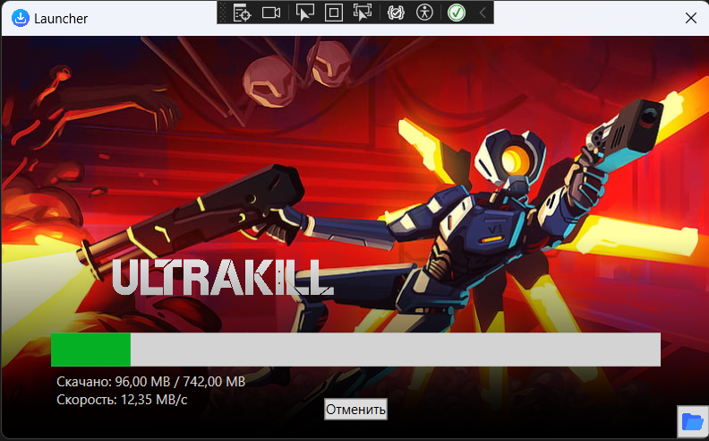

# Launcher

В UI должно быть реализовано:
- кнопка "зарузить" - загрузка архива ✅
- прогресс бар загрузки и распаковки ✅
- "остановить" - принудительная остановка загрузки ✅
- кнопка "открыть" - открытие папки распакованного архива.✅

Алгоритм программы следующий:
- при входе в программу видна только кнопка "загрузить" ✅
- клик по кнопке - виден прогресс бар и состояние загрузки, кнопка "загрузить" сменяется на "остановить" ✅
- началась загрузка, после загрузки - сразу идет распаковка архива ✅
- после окончания распаковки - кнопка "остановить" меняется на "открыть".*В проекте Играть* ✅❌
- по клику на кнопку "открыть" - открывается папка с распакованным архивом. ✅

Реализовать задачу в visual studio 2022 wpf .net 7+. ✅

Плюсом будет, если:
- добавить отображение данных скорости, состояния скачивания и распаковки под прогресс баром ✅
- давать возможность пользователю задавать путь, куда распаковать архив (это должно быть в самом начале, до скачивания)✅

Вариант усложненной версии программы*:
- реализацию скачивания файлов как как в торрентах ❌

## Demo

